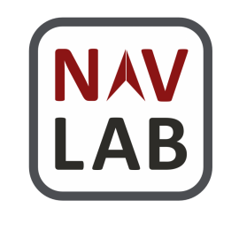

[](https://codecov.io/github/Stanford-NavLab/LuPNT)

# Welcome to the LuPNT Library

`LuPNT` is an open-source C++/Python library for Lunar Positioning, Navigation, and Timing Research.

> **Note**: This project is under active development.

## Source Code and Documentation

All source code is available on GitHub at [github.com/stanford-navlab/LuPNT](https://github.com/stanford-navlab/LuPNT).

The documentation is available at at [stanford-navlab.github.io/LuPNT/](https://stanford-navlab.github.io/LuPNT/).

## Attribution

This project is a product of the [Stanford NAV Lab](https://navlab.stanford.edu/).
If using this project in your own work please cite the following:

```
@inproceedings{IiyamaCasadesus2023,
  title = {LuPNT: Open-Souce Simulator for Lunar Positioning, Navigation, and Timing},
  author={Iiyama, Keidai and Casadesus Vila, Guillem and Gao, Grace},
  booktitle={Proceedings of the Institute of Navigation Gnss+ conference (ION Gnss+ 2023)},
  institution = {Stanford University},
  year = {2023},
  url = {https://github.com/Stanford-NavLab/LuPNT},
}
```

## Installation
### Step 1: Install Required Packages and Files
Todo: Create a bashfile to do the installation process.

- Third party libraries via git 
  - You can clone the libraries by updating the gitsubmodule by calling the following command from the /LuPNT folder
    - If it fails to install with the error message ``Error: Permission denied (publickey)``, it is likely because you don't have a key. See [here](https://docs.github.com/en/authentication/troubleshooting-ssh/error-permission-denied-publickey#make-sure-you-have-a-key-that-is-being-used) for the details
  ```
  git submodule update --init --recursive
  ```
  - The list of libraries that will be installed with the command above are:
    - [autodiff](https://github.com/autodiff/autodiff)
      - For automatic differentiation
      - Tested with v.0.6.12
      - Rename the entire folder to "autodiff", and place it under thirdparty
    - [Eigen](https://eigen.tuxfamily.org/index.php?title=Main_Page)
      - For vector and matrix computation
      - Tested with v3.4.0
      - Rename the entire folder to "Eigen", and place it under thirdparty
    - [pybind](https://pybind11.readthedocs.io/en/stable/installing.html)
        ```
        git submodule add -b stable ../../pybind/pybind11 pybind11
        git submodule update --init
        ```
- [cspice](https://naif.jpl.nasa.gov/naif/toolkit_C.html)
    - For planetary ephemris and frame conversion
    - Name the folder `cspice` and place it under thirdparty
    - Then move `cpsice.a` and `csupport.a` under `cspice/lib` to under `cspice/`
- [boost](https://www.boost.org/users/download/)
- [GMAT](https://sourceforge.net/projects/gmat/files/GMAT/GMAT-R2016a/)
  - Only required for testing
- Ephemeris Files 
  - See [here](data/ephemeris/readme.md) for instructions
  - You can extract the kernel files from [here](https://www.dropbox.com/sh/npgjdndt9ma3tmr/AADnjjwIsdwQwsuarLrHRF76a?dl=0) as well
  - Place the files under `/data/ephemeris`

In summary, you should have a directory as below

- LUPNT
  - data
    - ephemeris
    - speherical_harmonics
    - ...
  - lupnt
  - pylupnt
  - ...
  - third_party
    - autodiff
    - cspice
      - cspice
      - data
      - ...
      - cspice.a
      - csupport.a
    - Eigen
    - pybind11

### Step 2: Do Additional Setups
1. Add the path your .zshrc or .bashrc
```
$ export LUPNT_DATA_PATH="/absolute/path/to/the/data/folder/in/this/repo"
$ export GMAT_PATH="/path/to/GMAT"
```
2. If you are using VSCode (recommended), do the additional setups as listed [here](#working-with-vscode)

###  Step 3: Build the LuPNT Library
After the build is completed, the generated library will be located at `build/lupnt/liblupnt.a`

#### Option 1: From VScode (Recommended)
1. From Extensions, download `CMAKE Tools`
2. If you wish to use a conda environment or virtual environment, create and activate that environment. 
  - The reason to activate it here is to get the desired paths to python in step 3.

Example: 
```
conda activate (name of your environment)
```
3. Inside the .vscode directory in this project, create "settings.json" and add the following CMAKE option (This is required to robustly build pybind)
```
{
    // cmake settings
    "cmake.configureArgs": [
        "-DPYTHON_INCLUDE_DIRS=path1string",
        "-DPYTHON_LIBRARIES=path2string",
        "-DPYTHON_EXECUTABLE=path3string",
        "-DBUILD_EXAMPLES=ON"
    ]
}
```
In above, replace `path1string` with the output you get when typing in the following command in terminal
```
python3 -c "import sysconfig; print(sysconfig.get_path('include'))"       
```
Similarly, replace `path2string` with the output of the following command
```
python3 -c "import sysconfig; print(sysconfig.get_config_var('LIBDIR'))"
```
Finally, replace `path3string` with the output of the following command
```
which python
```

3. Configure and Build Project from the `CMAKE` tab

#### Option 2: From Terminal 
You can build the project by calling
```
$ mkdir build 
$ cd build
$ cmake .. -DPYTHON_INCLUDE_DIRS=$(python -c "import sysconfig; print(sysconfig.get_path('include'))")  \
-DPYTHON_LIBRARIES=$(python -c "import sysconfig; print(sysconfig.get_config_var('LIBDIR'))") \
-DBUILD_EXAMPLES=ON
$ make 
```
The two cmake options will add the path to the python libraries which is required to build pybind.

### Step 4: Install the Python LuPNT Library (pylupnt)
For developers, see [here](bindings/readme.md) for details on how to add new python bindings.
1. Run CMake to build the lupnt library with the python bindings (= execute step 3)
2. (activate your local virtual environment e.g. venv, conda)
3. Add permission to run the install script
```
$ sudo chmod 755 ./scripts/install_pylupnt.zsh
```
3. Build and install the lupnt library (run this every time you change your c++ or python library)
```
$ ./scripts/install_pylupnt.zsh
```
4. Now you can use the pylupnt library inside your project (see the codes under `examples_python/`)
```
$ install pylupnt as pnt
```

### Step 5: Run Unit Tests
To run the tests for the c++ codes, run the following script in the project root
```
$ ./build/test/runUnitTests
```

To run the tests for the Python bindings, run the following script in the project root 
```
$ python3 -m pytest test/python
```


## Reference for Developers
- [Astrodynmaics Convention and Modeling Reference for Lunar, Cisluunar, and Librartion Point Orbits](https://www.colorado.edu/faculty/bosanac/sites/default/files/attached-files/nasa_tp_20220014814_final.pdf)
- [Functions in Google Test](https://qiangbo-workspace.oss-cn-shanghai.aliyuncs.com/2018-12-05-gtest-and-coverage/PlainGoogleQuickTestReferenceGuide1.pdf)
- Debugging with GDB
  - Follow the process in this [video](https://www.youtube.com/watch?v=-tGSO5-eRRg)
  - If the error 'ERROR: Unable to start debugging. Unexpected GDB output from command "-exec-run". Unable to find Mach task port for process-id 5264: (os/kern) failure (0x5).' appears when running the gdb, follow the process shown [here](https://sourceware.org/gdb/wiki/PermissionsDarwin)


## Testing with GMAT
- Some of the dynamics functions are tested by comparing outputs with the [GMAT](library) python API
- See [here](https://sourceforge.net/p/gmat/git/ci/GMAT-R2020a/tree/application/api/API_README.txt) for instructions on how to setup the GMAT API for function
- If you are a MAC OS user in Apple Silicon, the current python interface for GMAT only works for x86 platforms. You can create a conda environment with x86 python with the following commands.
```
CONDA_SUBDIR=osx-64 conda create -n gmat-env python=3.9 -y
conda activate gmat-env
conda env config vars set CONDA_SUBDIR=osx-64
conda deactivate
conda activate gmat-env
```

## Working with VSCODE
- This project uses the [Google C++ Style](https://google.github.io/styleguide/cppguide.html).
  - Set the setting `C_Cpp: Clang_format_fallback Style` to `Google`.
  - Set `C_Cpp: Clang_format_style` to `Google` if it is not set to `file`.
- Install [prerequisites](https://code.visualstudio.com/docs/cpp/cmake-linux)
- Install the extension CodeLLDB
- Set up run/debug targets in the CMake window, or directly run targets
- Setup useful shortcuts (Cmd+K Cmd+S) to run your run/debug targets easily
  - CMake: Run Without Debugging
  - CMake: Debug
  - Debug: Start debugging
- To view Eigen and autodiff objects when debugging, modify the debugger configuration:
```
{
    "version": "0.2.0",
    "configurations": [
        {
            "name": "(lldb) Launch",
            "type": "lldb",
            "request": "launch",
            // Resolved by CMake Tools:
            "program": "${command:cmake.launchTargetPath}",
            "args": [],
            "cwd": "${workspaceFolder}",
            "initCommands": [
                "command script import \"absolute/path/to/your/eigenlldb.py\"",
            ]
        }
    ]
}
```
- A useful command for the debug console is `p` to print a variable or expression. For example, `$p rv_rx_gcrf->x_`, where `rv_rx_gcrf` is a `std::shared_ptr<State>`, results in:
```
(autodiff::VectorXreal) $2 = (
  [0] = 291587.67232231156, 
  [1] = 269354.82986367267, 
  [2] = 76112.184704362284, 
  [3] = -1.3616218570959222, 
  [4] = 0.66603497742054196, 
  [5] = 1.8768878200960224
)
```